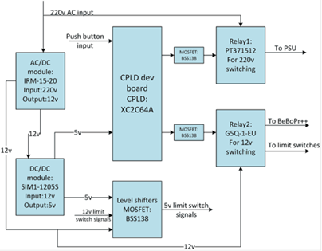
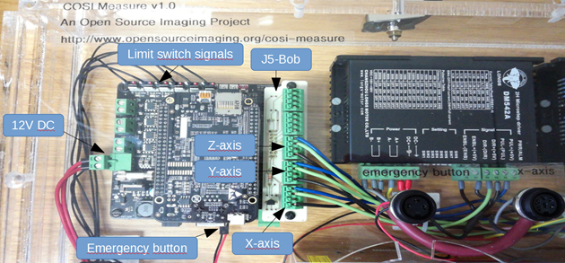
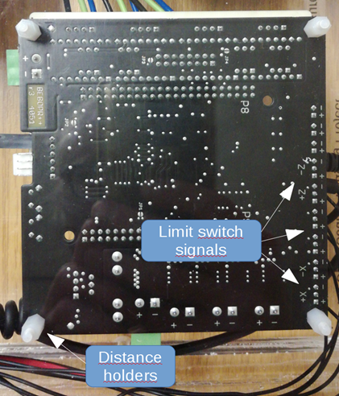
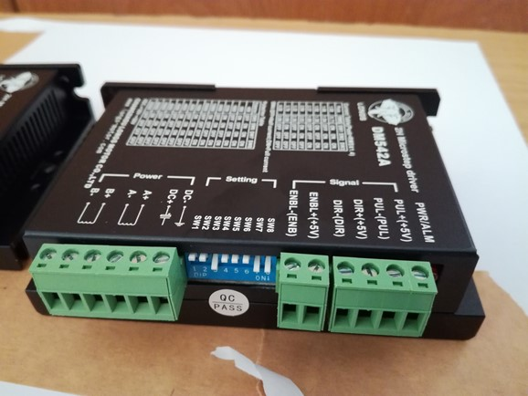
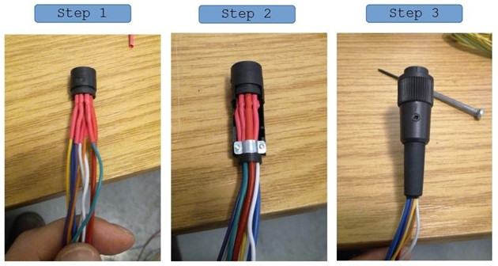

[M4x10 screws]:Parts.yaml#M4x10PanSteel
[No. 2 Phillips screwdriver]:Parts.yaml#Screwdriver_Philips_No2
[Crimp tool]:Parts.yaml#Crimp_Tool

<multimeter 
screwdriver 
cable stripper 
soldering equipment 
hot-air fan
Flasher>

{{BOM}}

# Power management board assembly 
The power management board interfaces a 220V AC input with all other DC powered components (Figure 3). An AC/DC module is used to generate a 12V DC power supply for the limit switches and the BeBoPr++ which powers the BBB with 5V. The CPLD is connected with two buttons and has two functions:
1. Pressing button 1 (power on/off) switches on the 12V DC power for the limit switches and the BeBoPr++, which switches on the BBB.
2. Pressing button 2 (motor on/off, after power on) powers on the 36V DC power supply of the stepper motors.

Block diagram of the power management board.

A general description of the functionality of the power management board is shown in Figure 4.

## Make the PCB of the power management board  {pagestep}

See Gerber files

## Assemble all electronic parts according to the schematic as seen in Figure 5-6 {pagestep}

Please note: There is a conversion error in the Gerber file and the holes for the relay are too small. You can use a file or driller to increase the hole size so that the relay fits.

## Program the CPLD using a JTAG programming cable.  {pagestep}

We used the Xilinx ISE 14.7 software (downloadable from the Xilinx website) → Labtools → Impact. After powering on the CPLD (e.g. over the power management board) and connecting the JTAG programming cable, the software should be able to detect both the programming cable used and the CPLD. Then it can be programmed with the code found in the COSI_pwr_CPLD folder.

## Test the functionality of the power management board and the CPLD. {pagestep}

Plug in the CPLD to the power management board and connect the board from the power socket to 230V AC (Figure 5). In standby mode a single LED should be powered on the CPLD (Figure 5, at the top right on the CPLD). In standby mode no power (12V DC or 230V AC at the motor output) should be turned on. After shorting/turning on the power on/off button (Figure 5), the 12V DC power should be turned on and the second LED on the CPLD lights on. Verify that by measuring the 12V DC power output and 0V AC power output at the motor power supply connection (Figure 5). Now shorten/turn on the motor power button (Figure 5). You should hear the relay clicking, see the third LED on the CPLD lighting on and measure 230V AC at the motor power output.

Figure 5 Photograph (top) of the assembled power management board.

Figure 6 Photograph (bottom) of the assembled power management board. On the left side the 12V DC output is displayed and on the right side the 230V AC input/output connections. Please note that due to some error in the gerber file creation using KiCAD the holes were too small for the relay pins. In order for the part to fit the holes have to be made bigger using e.g. a file. The two yellow/gree isolated cables are connecting the relay with the MOSFET switch.

# 2.	Connect the BeBoBr++ with the BBB and the J5-Bob

## Connect the BBB to the BeBoPr++. {pagestep}

Important: The BBB needs to be connected the right way otherwise you might damage the BBB. The side of the BBB with the micro HDMI, USB-Port and SD-card should be located over the pins (6x3) that are used for connecting the limit switches (Figure 7).

## Connect the J5-Bob {pagestep}

(we use the source-enable option, R1, Q2 and short to SRCE needed: https://github.com/modmaker/J5-BOB) to the BeBoPr++ (Figure 7). The connections for the motor axes, the limit switches, the emergency switch, the 12V power supply are displayed in Figure 7.

Figure 7 Photograph of the assembled BeBePr++ inside the casing. Please note that the USB cable and the HDMI cable were removed for the photo in order to better visualize the limit switch cables.

# Attach electrical components to the casing baseplate    

## Attach the distance holders at the position of the power management board (4x holes) and the BeBoPr++ (4x holes) {pagestep}

as indicated in (Figure 8). The distance holders should point inwards so that the BeBoPr++ and the power management board can be mounted on top.

Figure 8 Photograph of the assembled BeBoPr++ (backside of the casing) indicating the position of the distance holders and the +x, -x, +y, -y, +z, -z pin positions for the limit switch signals.

## Attach the BeBoPr++ and the power management board to the distance holders using M3x6 screws. {pagestep}

Make sure that the orientation of the boards is correct in order to not have any surprises later on with the wiring (check Figure 1 for reference).

## Set the pins (SW1-SW8) of the stepper motor drivers to the desired configuration. {pagestep}

These pins adjust the current output and step/revolution. Our configuration (1600 pulse/rev → microstepping factor 8) is displayed in Figure 9.

Figure 9 Pin setting of the stepper motor drivers for 1600 pulse/rev leading to a microstepping factor of 8.

## Attach the drivers using M3x15 screws and the power supply using the M4x10 screws to the baseplate. {pagestep}

Your assembled setup should look like in Figure 1.

## You can measure and adjust (there is a small screw) the DC output voltage of the motor power supply. {pagestep}

We have used a DC voltage of 36V for our setup

# Wire all components inside the casing

In this step we will connect all components that are on the casing baseplate. The approximate cable lengths can be deduced from the following table:

## In order to keep the avoid cable chaos we used mounting bases and cable straps.  {pagestep}

Attached the mounting bases as indicated in Figure 2 (five white squares) to the casing baseplate.

## Attach wire end ferrules to the cable Pos 18 at one end and a two-pole connector at the other end. {pagestep}

Connect the connector to the BeBoPr++ and the other end of the cable to the appropriate 12V DC connection on the power management board (Figure 5). Make sure to get the polarity right (check also Figure 3).

## Attach wire end ferrules at one end of the cables Pos 15-17 and connect the cables to the stepper motor drivers. {pagestep}

Connect the other end to the according axis and output of the BeBoPr++/J5-Bob as shown in Figure 7.

## Attached wired end ferrules to the cables Pos 11 at both ends of the cable. {pagestep}

Connect the 230V AC motor supply output of the power management board with the 230V AC power input of the motor supply.

## Attach wire end ferrules at both ends of the cables Pos  12-14. {pagestep}

Connect the cables at one end with the 36V DC power output and at the other with the power input of the stepper motor drivers (see also Figure 3).

## In order to connect the limit switch signals with the BeBoPr++, the pin strip wire (6x) needs to be soldered to the six pin strip wires (3x) (Pos 10, Table 1). {pagestep} 

The BeBoPr++ has three pin input connectors, but since we feed the BeBoPr++ via the power management board, we have a common ground, so eventually only the central pin is needed, which gives the inductive limit switch signal (high or 5V if no conductive surface is near the limit switch and ground if a conductive surface is close to the limit switch). You can clip the remaining two cables from the 3-wired pin strips and connect the central cable to one of the six cables from the 6-wired pin strip. After soldering you can use a shrinking tube to isolate the contact. Proceed until all cables from the 6-wired pin strip are connected to a cable with a 3-wired pin strip at the end (even though only one pin is effectively being used). At the end connect the 6-wired pin strip to the power management board. Make sure that you connect it to the 5V output not the 12V output (see also, Figure 3&5). In the last step connect the three-pin connectors to the BeBoPr++.

# Assemble the casing cover

In this step all sockets will be mounted to the casing cover as indicated in Figure 1 and Figure 10.

Figure 10 Schematic of the socket location on the front cover of the casing.

5.1.	Mount the Micro HDMI socket to the cover using two M3x6 screws.
5.2.	Mount the power socket to the cover using two M3x6 screws.
5.3.	Mount the USB socket to the cover.
5.4.	Mount the RJ45 socket to the cover.
5.5.	Connect a pin strip (2x) to the power on/off button and mount it to the cover (for wire lengths please see table 1).
5.6.	Connect a pin strip (2x) to the motor on/off button and mount it to the cover (for wire length please see table 1).
5.7.	Prepare the main power supply cable (for wire length please see table 1). At one end you can use wire end ferrules (using a crimping tool). At the other end blade receptacles. This improves the connectivity and durability of the contacts.
5.8.	Solder the motor cables to the 6-pole sockets (for wire length please see table 1). These will be connected to the stepper motor drivers. Remember your pin-selection since that will be used later for the stepper motor connectors as well in order to properly connect the phases of your stepper motors. We have used the following configuration:

| Pin        |   |
|------------|---|
| Pin 1	| B+ |
| Pin 2	| B- |
| Pin 4	| A- |
| Pin 5	| A+ |

Table 2 Pin assignment of the 6-pole socket used for the stepper motor connectors.

Be aware that the wire diameter used should be big enough for your max current (you can find many spreadsheets online to help you with the selection). We have used 0.75mm² cables for the stepper motors and limit switches. Don’t make the wires too short, otherwise you will have difficulties assembling all connections later on. At the other end of the wire you can optionally add wire end ferrules (using a crimping tool), which improves the connectivity and durability of the contacts.
It is recommended to use shrinking tubes after the socket connectors have been soldered. In particular for the limit switches there is not a lot of space between the pins. The shrinking tubes help to isolate the contacts, improving robustness and longevity of the system. The connector assembly steps are displayed in Figure 11.

|  |
|--|
| Figure 11 Photograph of different assembly steps of the connectors. A shrinking tube (red color) was added to improve isolation between connections.|

## Solder the 6-wired pin strip cables to the 8-pole socket pins. {pagestep}

Solder an isolated cable to the two remaining pins of the socket. Both the 6-wired pin strip (limit switch signals) and the two cables (12V power supply) will be connected later on to the power management board. Remember your pin-configuration for the socket since you want to make sure that it matches your pin-configuration connector of the limit switches. We have used the following configuration:

| Connector pin |  |
|-------------|----------|
Pin 1	| 6-wired pin strip cable 5
Pin 2	| 12V (+)
Pin 3	| 6-wired pin strip cable 2
Pin 4	| 6-wired pin strip cable 6
Pin 5	| 6-wired pin strip cable 1
Pin 6	| 6-wired pin strip cable 4
Pin 7	| 6-wired pin strip cable 3
Pin 8	| Ground (-)

Table 3 Pin assignment of the 6-pole socket used for the limit switch connector.

At the other end of the two cables for the 12V power supply of the limit switches you can optionally add wire end ferrules (using a crimping tool), which improves the connectivity and durability of the contacts.

## Solder the 2-pole pin strip with wires to the 3-pole emergency button connector. {pagestep}

Remember your pin-configuration for the socket since you want to make sure that it matches your pin-configuration connector of the emergency switch. We have used the following configuration:

| Connector | |
|-----|----|
Pin 1	| 2-wired pin strip cable
Pin 3	| 2-wired pin strip cable

Table 4 - Pin assignment of the 3-pole socket used for the emergency switch connector.

## Connect the USB cable to the USB socket. {pagestep}
## Connect the RJ45 cable to the RJ45 socket.  {pagestep}
# Connect front cover sockets/buttons to baseplate and close casing

##  Connect 6-wired pin strip of the limit switch connector to the power management board  {pagestep}

 (12V DC limit switch signals, Figure 5).

## Connect power cable of the limit switch socket to the 12V DC output on the power management board  {pagestep}

(Figure 5).

## Connect the 2-wired cable from the power on/off button to the power on/off connection on the power management board  {pagestep}

(Figure 5).

## Connect the 2-wired cable from the motor on/off button to the motor on/off connection on the power management board  {pagestep}

(Figure 5).

## Connect the three stepper motor sockets to the appropriate stepper motor driver.  {pagestep}
## Connect the 2-wired cable from the emergency button socket to the BeBoPr++  {pagestep}

(Figure 7).

## Connect the cables from the power socket with the power management board AC 230V power input  {pagestep}

(Figure 5).

## At the end you can fix the cables using cable straps and the provided mounting bases.  {pagestep}

Don’t fix the cable straps too tightly so that you have a bit of room to operate in case you ‘ll need to replace a cable and don’t want to cut the hole cable strap for that.

## Close the front cover by using the M5 screws.  {pagestep}

# Perform functional test of current setup
After all components have been connected you can test the setup.

## Plug in the power cable to the AC 230V power socket. {pagestep}

 One LED should switch on on the CPLD on the power management board.	             

## Press the power on/off button.  {pagestep}

A second LED should light on on the CPLD of the power management board. Also now the BeBoPr++ should be powered (green LED on) and shortly after the Beagle Bone Black should start booting (blue LEDs on).

## At the emergency switch input of the BeBoPr++ a red LED should be on indicating that the emergency switch is not connected.  {pagestep}

 If you shorten the two pins of the switch (e.g. at the emergency switch socket, the LED should turn off).

## Check the HDMI output of the BBB (it should have booted in the meanwhile) displaying the Linux interface.  {pagestep}

## Connect a keyboard/mouse (before booting the BBB) to the USB port and check if its working.  {pagestep}
## Press the motor on/off button.  {pagestep}

A third light should light up on the CPLD, indicating that the power supply was switched on. In order to confirm that, check if a green LED is on at the power supply. Now the stepper motor drivers should be supplied with the 36V DC power and each driver should have a green LED on.

# Status LED overview

BeBoPr++/BBB
→ for all status LEDs check the BeBoPr++ documentation
→ If the emergency button is disconnected a red LED is power on at the emergency button connection
→ If the limit switches detect a conductive surface, red status LEDs are powered on at the respective limit switches
→ A green LED indicates power on for the BeBePr++
→ A blue LED indicates power on of the BBB

Power supply
→ Green LED indicates power supply is on and DC power is supplied to the stepper motor drivers

Motor drivers
→ Green LED indicates power supply is on

Power management board
→ A single power on LED on the CPLD indicates the standby mode, when the power cable is connected, but the power on/off button has not been turned on yet.
→ After turning on the power on/off button another LED (2nd one, next to the previous one) lights on. It indicates that the 12V DC power has been switched on. Now the BeBoPr++ should be powered on and the BBB.
→ After pressing the motor on/off button another LED (3rd one, three powered on LEDs in total) lights on. It indicates that the 230V AC voltage is routed to the power supply, which generates 36V DC for the motors. The motors are power on now and the system is fully operational.

