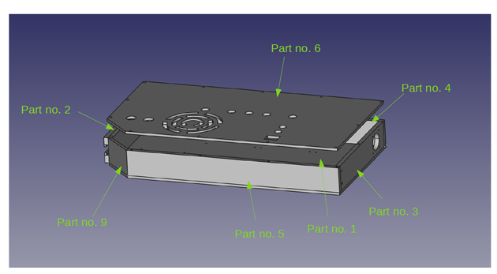
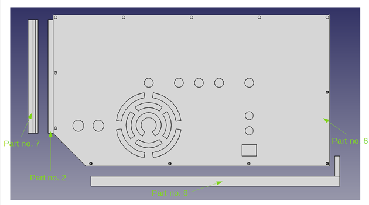
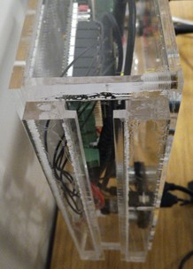
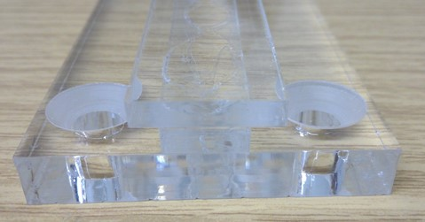
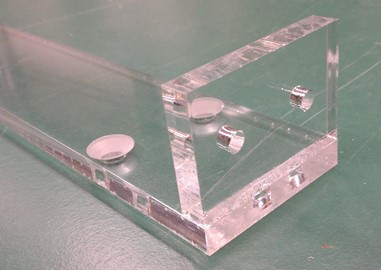
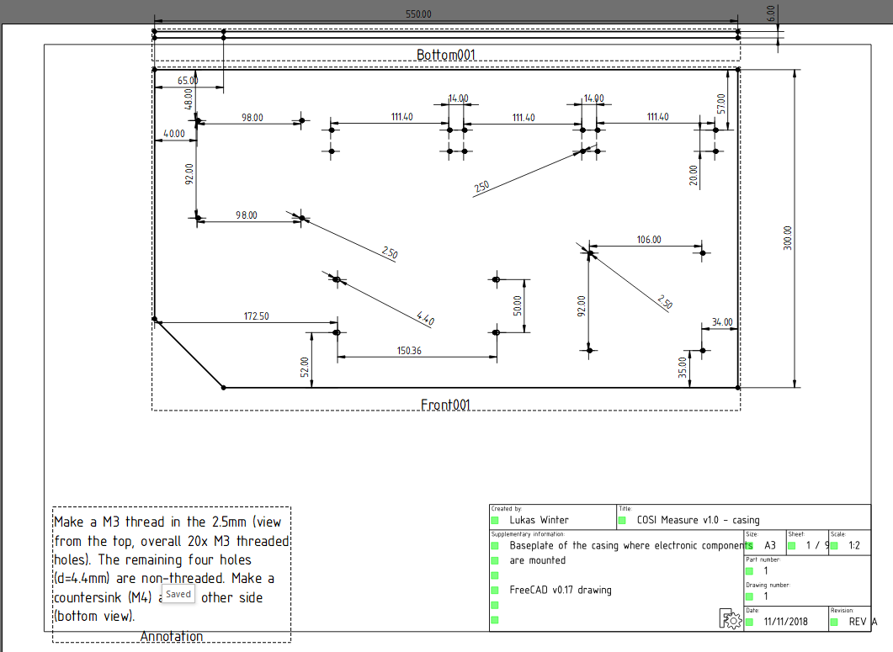
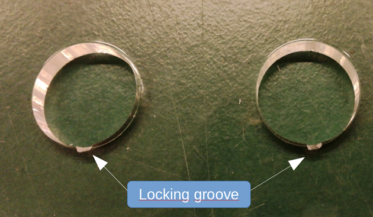

[M4x10 screws]:Parts.yaml#M4x10PanSteel
[No. 2 Phillips screwdriver]:Parts.yaml#Screwdriver_Philips_No2

Add to tools:

•	Glue (e.g. Acrifix)

•	Screw clamps (optional)

•	File

# Casing

{{BOM}}

## Overview

We have created a 3D CAD model of the casing with FreeCAD (Figure 2). The casing consists of 9 overall parts, which can be fabricated e.g. from Acrylic glas (we used transparent acrylic glas for educational purposes, to highlight the open source nature of the project and to see all the status LEDs from the individual hardware components). For our purposes we have used a laser cutter to fabricate all components based on scalable vector graphics (.SVG) files extracted from the FreeCAD model. Alternatively technical drawings (PDF) are available that display all features of the casing.
A visual overview of all parts is provided in partnumber_overview.pdf (Figure 2-3).

Figure 2 3D CAD model and part numbers of the casing.

Figure 3 3D CAD model and part numbers of the casing.

Part no. 2, part no. 7 and part no. 8 can be also fabricated by laser cutting smaller subcomponents and gluing these together (see also Figure 4-6). The .svg files of the subparts are available on the github page.

## Functionality of the casing
Part no. 7 can be mounted to the z-axis and part no. 8 can be mounted to the x-axis of the COSI-Measure aluminum frame. In this configuration it is possible to slide the hardware casing via part no.2 into part no. 7. There are two small screws that connect part no. 8 and part no. 3 to stabilize the casing in this position. As such the hardware is fixed to the mechanical part of COSI-Measure and does not require extra space. If needed the casing can be removed e.g. if the measurement setup requires that (e.g. space constraints, electrical noise etc.) or e.g. to use the electronics in a different experimental setup where stepper motor drivers are needed. In order to remove the casing only the two screws (part no. 8) have to be removed and the casing can slide out.
The Open Source Imaging Logo in the front cover (part no. 6) is located directly above the power supply. It is for air circulation inside the casing. A simpler geometry (simple holes) can be used in case a laser cutter or similar is not available to cut out this “complex” shape.

## Assembly of the baseplate

Glue parts no. 2-5 to the baseplate (part no. 1) as shown in Figure 7 (The threaded holes should be pointing up so that the front cover can be later on screwed to them). Depending on your material you’ll need to select an appropriate glue. We have used Acrylic Glas as a casing material and Acrifix as an adhesive. In order to hold the parts in place until the glue drys, screw clamps can help. Make sure to glue the parts accurately, otherwise the holes in the cover might not be overlapping properly and it will be difficult to close the casing.

## Frontcover sockets

For the sockets in the casing a locking groove is needed for the 3-pole, the 8-pole and the three 6-pole sockets. If can be easily made using a small file (Figure 8) if a laser cutter is not available.

## Mount the handle

Mount the handle using all components to part no. 4 of the assembled casing

## Functional tests
Test if part No. 7 can easily slide through part no. 2.
Test if the cover can be screwed to the finished baseplate.
Test if part no. 8 can easily be screwed to part no. 3.
Test if the locking grooves sufficiently lock the sockets.

# Comments
Here we are collecting a list of issues and improvements. If you found any errors in the documentation, have ideas/suggestions for improvements or if you did some modifications, please let us know (you can edit this document with the tracking function and send it to us).

Issues/Improvements (minor)

M5 countersunk screws are slightly too big for an acrylic cover. Better using M4 or M3 or no countersink.

Locking grooves are not included yet in the 3D CAD model and other files (e.g. SVG). Can be easily added later on using a file (see step 3 of this document)

In the svg file of the front cover a hole is missing of the power socket (exporting bug FreeCAD?). Can be easily drilled later on.

