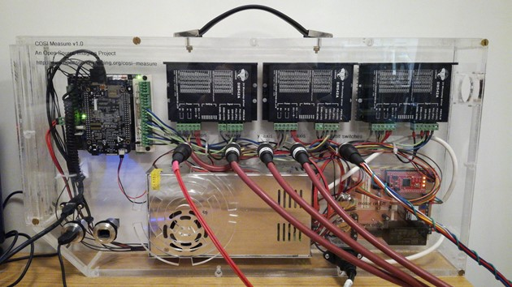
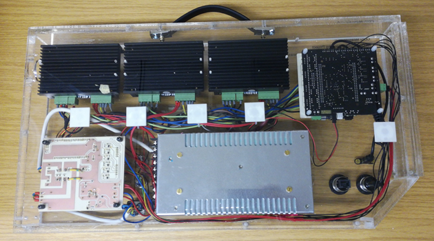
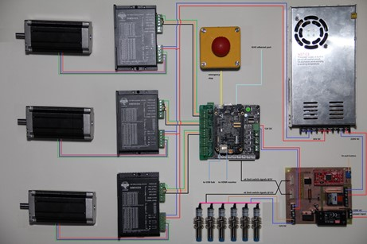

# COSI-Electronics

# COSI-Measure v1.0
## Electrical Assembly

|Rev.	| Date  (YYYY-MM-DD)	| Description of Change	 | Author/Contributors |
|----|---|---|---|
1.0	| 2019-01-10 |	Initial version | 	Lukas Winter, Haopeng Han
1.0.1  |  2024-10-09 | GitBuilding adaptations | Lionel Broche, Matthew Beddows 
			

## ABOUT
Please find below the assembly documentation for COSI measure a 3D multipurpose measurement system. If you find any flaws or if you have any questions/suggestions with regards to this document or project please let us know lukas.winter@ptb.de. Improving the quality of this work and its documentation makes it easier for others to reproduce and build upon this work.

Documentation published describing Hardware is licensed under the CERN OHL v. 1.2. You may redistribute and modify this documentation under the terms of the CERN OHL v.1.2. (http://ohwr.org/cernohl) except otherwise stated.
	            
This documentation is distributed WITHOUT ANY EXPRESS OR IMPLIED WARRANTY, INCLUDING OF MERCHANTABILITY, SATISFACTORY QUALITY AND FITNESS FOR A PARTICULAR PURPOSE. Please see the CERN OHL v.1.2 for applicable conditions.

If you find COSI measure useful in your work, please cite this paper:
Han H, Moritz R, Oberacker E, Waiczies H, Niendorf T and Winter L, „Open Source 3D Multipurpose Measurement System with Submillimetre Fidelity and First Application in Magnetic Resonance“, Scientific Reports, 7:13452, 2017
Introduction
This document describes the electrical assembly of COSI Measure. The partlist can be found in the electronics bill of material (BoM) v1.0 file.
A more detailed description of COSI Measure can be found here: http://www.opensourceimaging.org/project/cosi-measure/
and here:
Han H, Moritz R, Oberacker E, Waiczies H, Niendorf T and Winter L, „Open Source 3D Multipurpose Measurement System with Submillimetre Fidelity and First Application in Magnetic Resonance“, Scientific Reports, 7:13452, 2017

Figure 1 Final electrical setup of COSI Measure inside the casing (front view).

Figure 2 Final electrical setup of COSI Measure inside the casing (back view).

Figure 3 General wiring diagram of the electronic subsystem.

* [.]{BOM} page.

* [.](COSI_Electronics-Assembly_instruction.md){step}

## Comments
Here we are collecting a list of issues and improvements. If you found any errors in the documentation, have ideas/suggestions for improvements or if you did some modifications, please let us know (you can edit this document with the tracking function and send it to us).

## Known issues
•	software bug in the CPLD code → status LED is still on after the motor power has been switched off
•	PCB design file needs bigger holes for the relay (initial KiCAD file looks good but the conversion to Gerber somehow creates this error)

## Improvements
•	A fuse might be added to the power socket
•	small sockets and connectors might be added directly after the steppers/limit switches (→ easy exchange of components)
